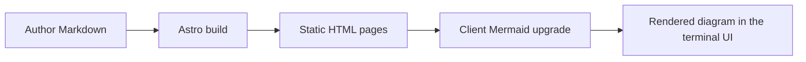

# Mermaid in local docs

The diagram below is authored directly in Markdown.



## Notes

- No page-specific JavaScript is needed.
- The layout provides one shared client enhancement.
- The same approach works for generated Markdown pages too.

```ts
export async function getStaticPaths() {
  return entries.map((entry) => ({
    params: { slug: entry.id.split('/') },
    props: { entry }
  }));
}
```
